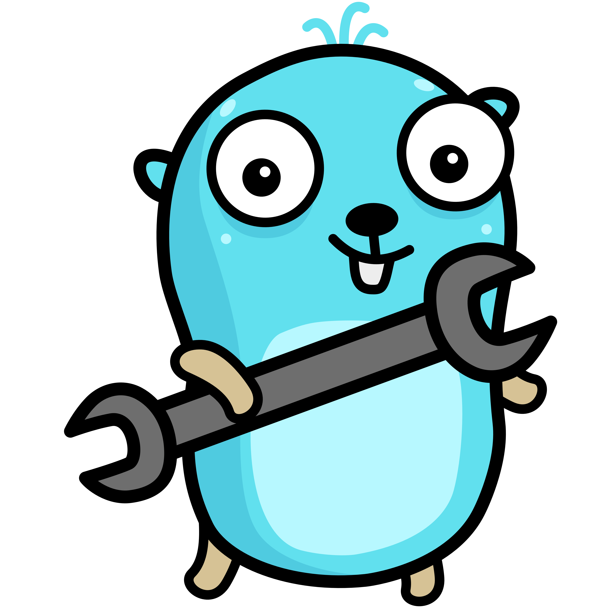

    <h2 align="center">This course is currently a WIP</h2>

    Expected completion: <b>Q2 2024</b>

 

    

### Structure

- [Lectures](https://github.com/course-go/lectures): set of lecture slides covering topics of the course
- [Exercises](https://github.com/course-go/exercises): set of exercises designed as complementary work to lectures for students
- [Homework](https://github.com/course-go/homework): set of graded homework
- [Course](https://github.com/course-go/course): general repository for course information, course schedule, discussions and resources
- [Code](https://github.com/course-go/code): contains code used throughout the course exercises and homework
